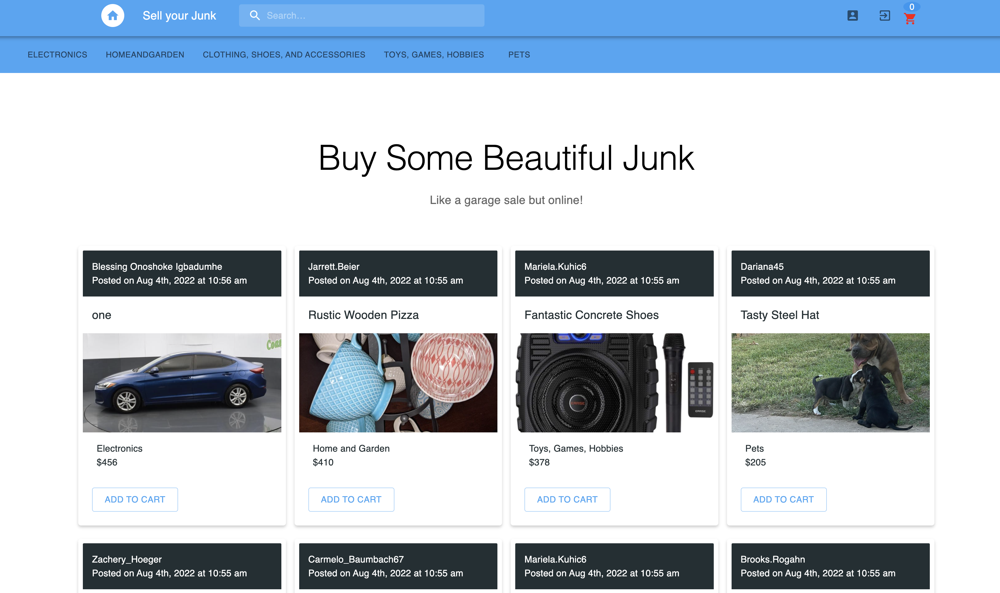

# Sell-Your-Junk
A commercial website for to sell goods or items not needed any more

## Developers
1. Jessica Sisavath
2. Ambrose Shokunbi
3. Damien Hebert
3. Blessing Igbadumhe

## User Story
    As a user I want to visit a website where I can search for products to buy and I can upload products I do not need to sell

## Acceptance Criteria
    When users visits website then they are presented with differnt products present by differnt users for purchase, Users can visit single pages. Users are also presented with a login and signup button

    When users signup or log in, they are taken to their private dashboard with their username to show It is theirs private dashboard and it is Authenticated with jwt token

    When users signup or login, their profile will have a form to upload junks they wish to sell. They are able to see all presently posted jobs by them

    When User is on the homepage, they can click on pics to route to a single page and see description on the product to help see if they intend to buy

    When a user sees a product they like, they can add it to the cart to be purchased

    When a user click on Add a post, the post is immediately added without any need to refresh

    When a user clicks on the nav, products are filtered according to the categories clicked on

    when a user clicks on the search to search for a product, the products are immediately filtered acording to their search

## Installation Instruction on localhost
`npm install`
### Serve on localhost:3001
`npm run seed` - To include fake data
 
`npm run develop`

## WebSite link On Heroku
https://sell-your-junk.herokuapp.com/

## Tech Stack
CSS, JavaScript, Node, Express, React, MongoDB, Mongoose, Graphql, Apollo-server, ApolloClient and Material UI.

## MVP (Minimum Viable Product)
Users are able to signup, login and make use of the search bar and filter the navbar

## Animated Gifs/Pictures of Website

## Repositories
https://github.com/Jessiferizzo/DumpYourJunk.git