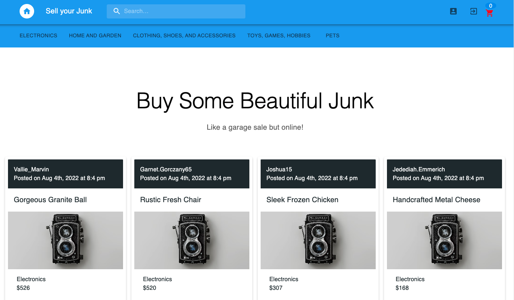

<h1 align="center"> Sell-Your-Junk </h1>  
<h3 align="center">An e-commerce website to buy and sell home products locally</h3>

---

  # Description
  A MERN stack database website built using React, MongoDB, Mongoose, Express.js, GraphQL, Apollo-server and Node.js that allows buyers and sellers to interact by the purchase of goods. Sellers can create profiles, upload item pictures and list items for sale while buyers can browse locally to buy items nearby.

  ## User Story
    As a user I want to visit a website where I can search for products to buy and I can upload products I want to sell

## Acceptance Criteria
    When users visit the website, they are presented with different products displayed by differnt users, all for purchase. Users can visit single pages. Users are also presented with a login and signup page.

    When users signup or log in, it is authenticated with jwt token. They are taken to their private dashboard and the dashboard displays all the items they have uploaded for sale.

    When users signup or login, their profile will have a form to upload items they wish to sell. They are able to see all a photo gallery of all items currently on sale on the site.

    When user is on the homepage, they can click on pictures to route to a single page and see a bigger picture of the item with description, pricing, seller info.

    When a user sees a product they like, they can add it to the cart to be purchased.

    When a user clicks on add a post, the post is instantly dynamically rendered on the profile page.

    When a user clicks on the navigation bar, products are filtered according to the categories.

    When a user clicks on the searchbar to search a product, the products are immediately filtered by categories matching the search words.

  # Table of Contents
  * [Site](#site)
  * [Installation](#installation)
  * [Usage](#usage)
  * [Questions](#questions)
  * [License](#license)
  ---

  # Site

 [WEBSITE for Sell Your Junk](https://sell-your-junk.herokuapp.com/)

 [Project Github Repo](https://github.com/Jessiferizzo/DumpYourJunk.git)
  
  📷 
 

 

 

  ## Built With:
 CSS, JavaScript, Node, Express, React, MongoDB, Mongoose, Graphql, Apollo-server, ApolloClient and Material UI
  
  # Installation
  💾 
  `npm install`
  
  # Usage
  1. First user must clone the repo, then run `npm install`
  2. Ensure you have mongoDB installed and running first. 
  
  3. Seed the database using `npm run seed`
  
  4. Start the server using `npm rund develop` at root of project in the terminal.

---
  
  ## Questions
  Please contact us using the following links:

  :octocat: Github [Jessiferizzo](https://github.com/jessiferizzo) 

  :octocat: Github [Blessing](https://github.com/BlessingI) 

  :octocat: Github [Ambrose](https://github.com/ashokunb)
  
  :octocat: Github [Damien](https://github.com/DH0710)

  ## Acknowledgments
 MIT licensing, our great instructors and TAs, graders, and classmates

  ## License
  
  Read more about MIT here:
  [MIT](https://opensource.org/licenses/MIT)

  Copyright (c) 2022 